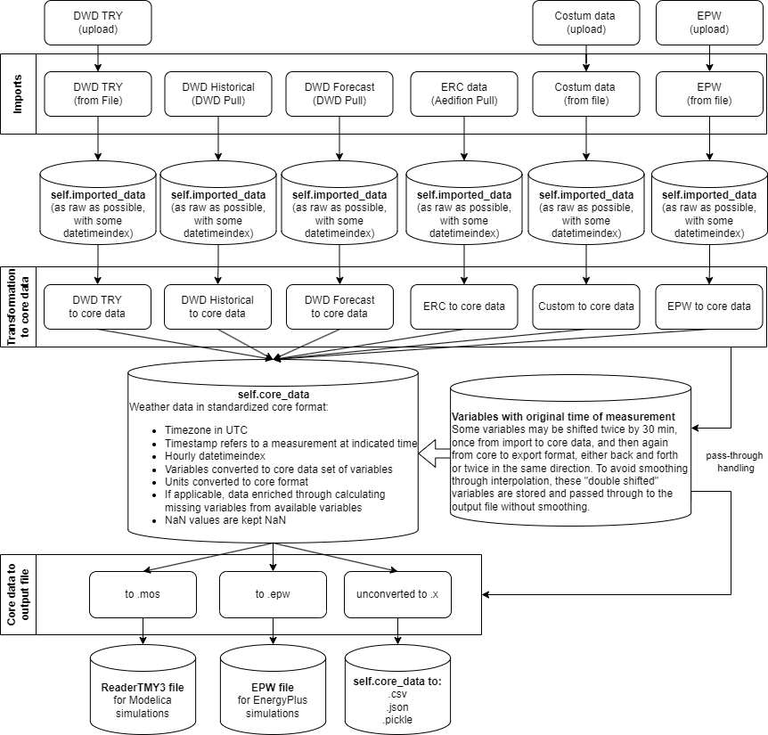

# Summary

AixWeather is a tool for generating weather data for building energy system simulations. 
It can be used to retrieve, format, enrich, and ultimately export weather data in various file formats.
It addresses the challenges researchers and industry players face in obtaining accurate and 
formatted weather data by providing a streamlined process.

**Key features of AixWeather**:

*Data retrieval*: AixWeather can directly retrieve data from the German weather provider DWD and supports historical, recent, and forecasted weather data retrieval. It also supports uploading test reference years (TRY) from the DWD and .epw files from EnergyPlus. A custom weather data upload is also supported, but depending on the import structure, the user needs to adjust the transformation code.

*Data conversion*: AixWeather converts this raw weather data from various sources into a defined core format and, from there, into the desired export format.

*Data accuracy*: AixWeather ensures data accuracy by taking into account critical factors that are 
often overlooked in custom solutions, including consideration of time zones, 
the time reference of the measurement, unit conversions, correct handling of incomplete data series 
and, where possible, the avoidance of interpolation-related smoothing.

*Data enrichment*: AixWeather uses physical relationships to calculate missing weather variables
from the available weather- and metadata.

*Flexibility*: AixWeather offers a modular structure that simplifies the addition of new import and
output formats, and the maintenance of existing formats.

*Modelica ReaderTMY3 compatibility*: A particular feature of AixWeather is its support for generating weather data compatible with the Modelica ReaderTMY3 format. This covers a so far unsatisfied need.

# Statement of need

Building energy simulations, crucial for research in building energy systems, 
often rely on specific weather data formats. Creating such weather data can be a 
labor-intensive and error-prone task. AixWeather addresses these challenges by offering 
a comprehensive solution for pulling, transforming, enriching, and exporting weather data from 
various sources and formats.

Some tools focus on generating typical meteorological year (TMY) data, like the PVGIS [@PVGIS.2023] from the European Commission, which provides TMY exports in .csv, .json, and .epw formats.
EnergyPlus [@EnergyPlus.2017], a widely used building energy simulation tool, also provides a 
weather data converter to cover the needs of its users, again only supporting the .epw format.
There is a lack of tools supporting conversions to the ReaderTMY3 format.
The ReaderTMY3 is a Modelica model of the well-established open-source library Buildings
[@WetterZuoNouiduiPang.2014].
Other libraries, such as the open-source library AixLib [@Maier.2023], import this model
to handle weather data.
Often users of these libraries, who do not have a TMY3 file at hand, get stuck or spend a lot of time to convert their weather data into the required format.
Solving this problem was the initial motivation to develop AixWeather.
Moreover, there are only limited tools for importing real, historical or 
forecast, weather data and converting it to building energy simulation formats.
The same is true for the Test Reference Years (TRY) of the German Weather Service (DWD). 
AixWeather also addresses these needs, making it a valuable tool, not only for researchers who work with the ReaderTMY3 format.

[//]: # (AixWeather is regularly used by users of the open-source library AixLib. Due to the )
[//]: # (recent open source release and the lack of a citable reference, there has yet to be a citation.)

# Accessibility

AixWeather can be accessed through the GitHub repository itself (https://github.com/RWTH-EBC/AixWeather), e.g., to be incorporated in simulation automation workflows.
For manual weather data generation, we recommend our locally hosted web application at 
https://aixweather.eonerc.rwth-aachen.de, which omits the need to set up an environment.
The web application's source code is open source and hosted in a separate repository at 
https://github.com/RWTH-EBC/AixWeather-WebApp.

# Structure of AixWeather

\autoref{fig:AixWeatherStructure} shows the current data flow and structure of AixWeather. 
First, the data is imported as raw as possible, to enable inspection of the raw data. 
The imported data is then converted into a core format, including all transformations like data 
enrichment, unit conversions, time zone and measurement time handling.
The core format is a defined format that allows for generalized conversion to the different export 
formats. 
The pass-through handling avoids avoidable interpolation-related smoothing by storing the original 
unsmoothed time series and, if the shift sequence allows, overwriting the smoothed time series 
in the output file.

# Acknowledgements

We acknowledge contributions from Michael Mans, Felix Nienaber, and Ana Constantin for providing 
some functional base code.
We also want to thank Firas Drass and Felix Rehmann from TU Berlin for their support on the WebApp.
Lastly, we want to thank Fabian Wüllhorst and David Jansen for their support with quality management through continuous integration.

# References