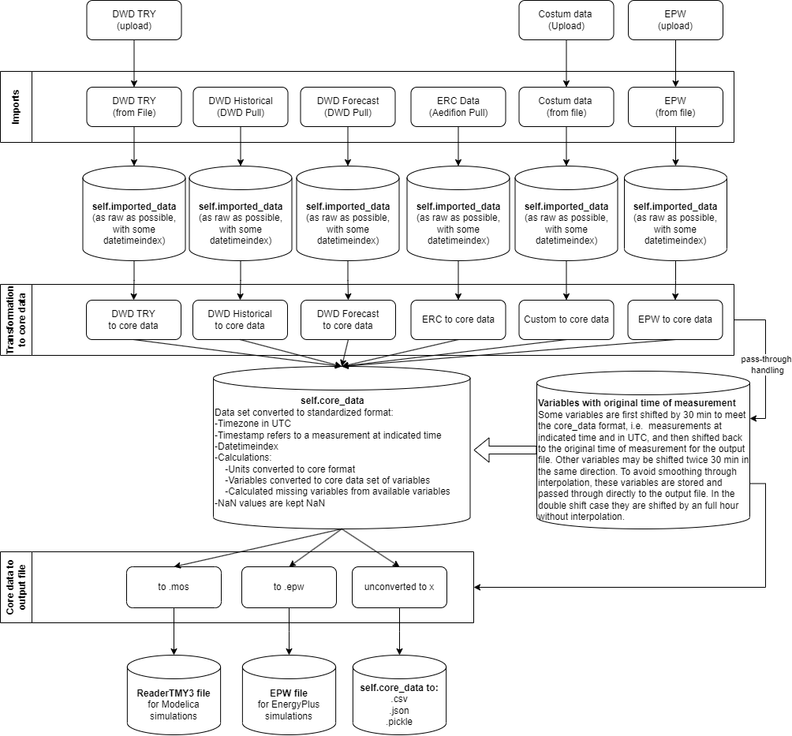

# Summary

AixWeather is a versatile weather data generation tool designed to simplify the process of acquiring, 
formatting, and exporting weather data for building energy system simulations. 
It addresses the challenges researchers and industry players face in obtaining accurate and standardized weather 
data by providing a user-friendly platform.

Key features of AixWeather:
Data retrieval: AixWeather can directly retrieve data from the german weather provider DWD, and 
supports historical, recent and forecasted weather data retrieval. It also supports the upload 
of test reference years (TRY) from the DWD and epw files from EnergyPlus. A custom weather data 
upload is also supported, which depending on the data structure, needs to be adjusted by the user.
Data conversion: AixWeather converts this raw weather data from various sources into a standardized core format and from there into the desired export format.
Data accuracy: AixWeather ensures data accuracy by taking into account critical factors that are often overlooked in custom solutions, including consideration of time zones, the time reference of the measurement, unit conversions, correct handling of incomplete data series and, where possible, the avoidance of interpolation-related smoothing.
Data enrichment: AixWeather uses physical relationships to calculate missing weather variables from the available weather data and metadata.
Flexibility: AixWeather offers a modular structure that simplifies the addition of new import and output formats. The maintenance of existing formats is also simplified, enabling a faster response to changing weather data formats.
Modelica ReaderTMY3 compatibility: A special feature of AixWeather is its support for generating weather data compatible with the Modelica ReaderTMY3 format. This covers a so far unsatisfied need.

AixWeather can be accessed through the repository itself, or through the web application at 
https://aixweather.eonerc.rwth-aachen.de. The web application provides a user-friendly interface
for fast generation of weather data without the need of setting up an environment.

AixWeather empowers researchers and professionals working in building energy systems by streamlining 
the weather data generation process. It ensures the availability of high-quality weather data, enabling researchers 
to focus on their essential work in the field of building energy systems.

\autoref{fig:AixWeatherStructure}

# Statement of need

Building energy simulations are crucial for research building energy systems, 
often relying on specific weather data formats. Creating such weather data can be a 
labor-intensive and error-prone task. AixWeather addresses these challenges by offering 
a comprehensive solution for pulling, transforming, and exporting weather data from various sources and formats.

There are limited tools available for importing and converting real weather data or Test Reference Years (TRY). 
Also, there is a lack of tools supporting the ReaderTMY3 format.
AixWeather offers a practical solution to a critical need in the field, making it a 
valuable tool for researchers working with this specific output format.
The ReaderTMY3 is a modelica model of the well established open source library Buildings
[@WetterZuoNouiduiPang.2014].
Other libraries such as the open source library AixLib [@Maier.2023] import this model
to handle weather data.

# Acknowledgements

We acknowledge contributions from Michael Mans, Felix Nienaber and Ana Constantin for providing 
some functional base code.
We also want to thank Firas Drass and Felix Rehmann from the TU Berlin for their support on the 
WebApp.
Last but not least, we want to thank Fabian Wüllhorst and David Jansen for their support with the 
quality management through continuous integration.

# References