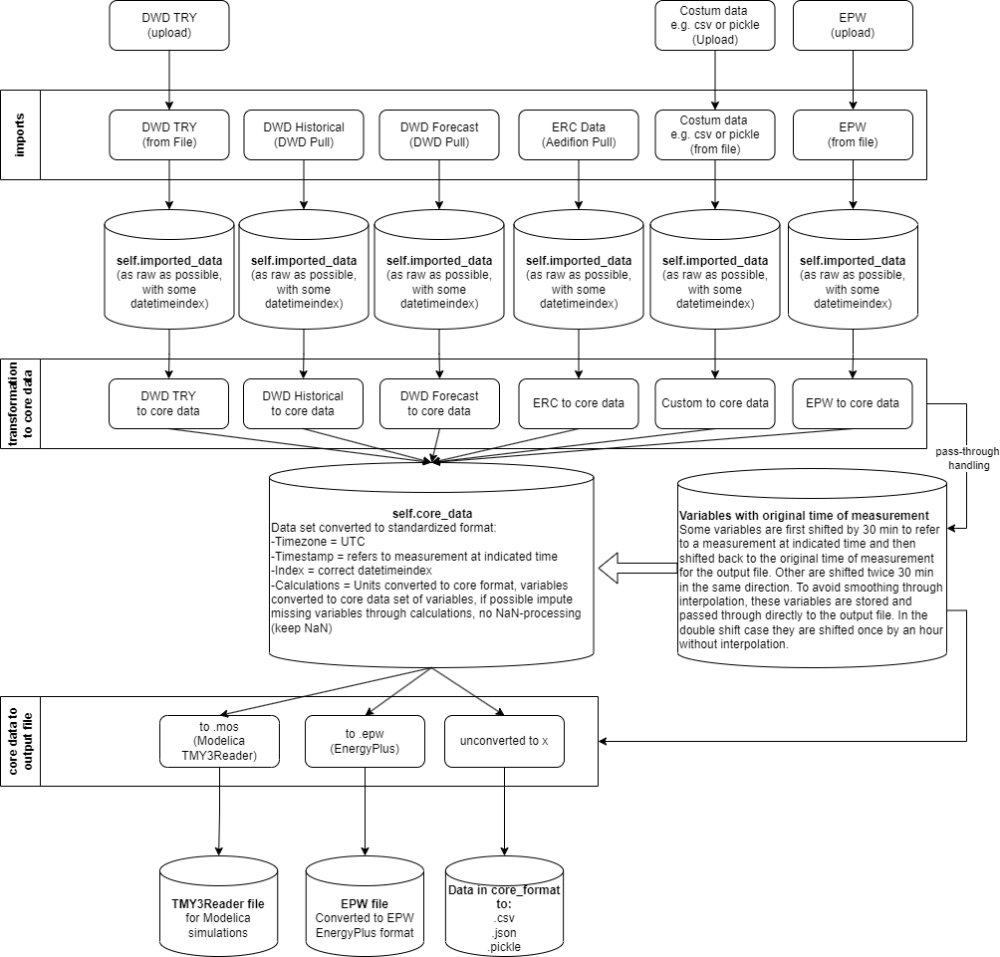

# ebc-weather-tool - weather data for simulations

## WebApp

For fast and easy accees use the WebApp.
The repository **[EBC-Weather-Tool-WebApp](https://github.com/RWTH-EBC/EBC-Weather-Tool-WebApp)** contains the corresponding WebApp for this repo.
This repository contains the functionalities, which can be used for automated weather data generation. 

## How to use
For each data origin a class is defined. See the examples to know how to use them.  

## Tool structure and overview
**This tool consists of three layers:**

1. import raw weather data from several sources

2. transform the weather data to a defined core-format with consideration of:

    2.1. time zone

    2.2. time of measurement (whether a value at a certain time stamp is for the indicated time or e.g., the average of the preceding hour)

    2.3. avoidance of smoothing through interpolation (pass through variables without interpolation if possible)

    2.4 units

    2.5. calculate missing variables from available ones, e.g. horizontal direct radiation from diffuse and global radiation. 

    2.5 missing data

3. transform the core-format data to your desired output format

**Overview**



**Known limitations:**
- only hourly data

**Chances:**
- generic code base that allows for fast and easy extensions to both other import formats and output formats


# Station IDs and KML grid IDs**

The station IDs for the DWD weather stations to pull historical data from are listed [here](https://www.dwd.de/DE/leistungen/klimadatendeutschland/statliste/statlex_rich.txt;jsessionid=68E14BA255FE50BDC4AD9FF4F835895F.live31092?view=nasPublication&nn=16102). Only german stations available. Aachen would be 15000.

The KML grid IDs for the DWD forecast are listed [here](https://www.dwd.de/DE/leistungen/met_verfahren_mosmix/mosmix_stationskatalog.cfg?view=nasPublication&nn=16102). Worldwide station available. Aachen would be 10505.

You may use the imported package [Wetterdienst](https://github.com/earthobservations/wetterdienst) to search for stations automatically, like described [here](https://bookdown.org/brry/rdwd/station-selection.html).


# Sources of information for corresponding data formats

## Input

**Test Reference Years (TRY)**: 

[Handbuch](https://www.bbsr.bund.de/BBSR/DE/forschung/programme/zb/Auftragsforschung/5EnergieKlimaBauen/2013/testreferenzjahre/try-handbuch.pdf). TRY data can be downloaded from the DWD (sign up required but for free) [TRY data sets](https://www.bbsr.bund.de/BBSR/DE/forschung/programme/zb/Auftragsforschung/5EnergieKlimaBauen/2013/testreferenzjahre/01-start.html;jsessionid=5D9912D230EB887C1F831671303A8A0F.live21304?nn=2544408&pos=2). 

Additional information on suitability of TRY data (last update: 2019):
There are typical TRY datasets grouped by the year of publication:
- 2004 datasets: (DWD; some errors in solar radiation; dataset should be avoided).
- 2010 datasets: suitable for EnEV and GEG, not for solar thermal simulations.
- 2015 datasets: not suitable for EnEV and GEG, but for solar thermal simulations
- Overall: Reliable quantities in TRYs are only the air temperature
and the global radiation!


**DWD historical**: [open data website](https://opendata.dwd.de/climate_environment/CDC/observations_germany/climate/)

**DWD forecasts (MosMix or KML files)**: [open data website](https://opendata.dwd.de/climate_environment/CDC/observations_germany/climate/) go to content.log.bz2.

**EnergyPlus (EPW)**: 

for format information, see output formats. Online sources for EPW data: https://climate.onebuilding.org/default.html and https://www.ladybug.tools/epwmap/

**ERC data:**
This data is from the weather station of the Institute for Energy Efficient Buildings and Indoor Climate (RWTH). Access requires user credentials. Such credentials are pre-defined if you use the WebApp.

## Output formats

**EnergyPlus (EPW):**

[3rd party format description](https://designbuilder.co.uk/cahelp/Content/EnergyPlusWeatherFileFormat.htm)

**Modelica ReaderTMY3:**

TMY3 reader from the [IBPSA](https://github.com/ibpsa/modelica-ibpsa) library used in the [AixLib](https://github.com/RWTH-EBC/AixLib) library: [OpenModelica](https://build.openmodelica.org/Documentation/Buildings.BoundaryConditions.WeatherData.ReaderTMY3.html).
It claims to use mainly [TMY3 data](https://www.nrel.gov/docs/fy08osti/43156.pdf), though we found that the pressure is used in mbar instead of Pa. Further deviations possible.

Additional information for AixLib users:
Weatherdata usage in the low order model (LOM):
Used in LOM:
- TDryBul
- RelHum
- TBlaSky (calculated via: HInfHor, TDryBul, TDewPoi and OpaSkyCov)
- HGloHor
- HDifHor
- HDirNor

Not used in the LOM:
- total sky cover
- ceiling height
- wind direction
- wind speed
- atmospheric pressure

**Unconverted to x**

exports the core data without conversion to .csv, .json or .pickle files.

# How to contribute to the development

You are invited to contribute to the development of this weather tool.
Issues can be reported using this site's Issues section.
Furthermore, you are welcome to contribute via Pull Requests.

# How to cite

[ToDo]()
DOI:  ToDo  

```
@inproceedings{ToDo}
```

# License

The weather tool is released by RWTH Aachen University, E.ON Energy Research Center, Institute for Energy Efficient Buildings and Indoor Climate and is available under a 3-clause BSD-license.
See [license](LICENSE).
